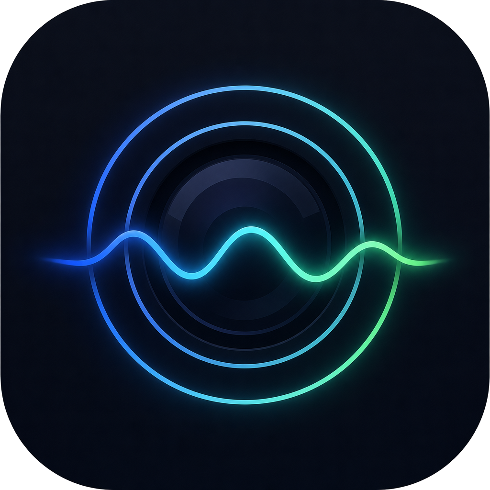
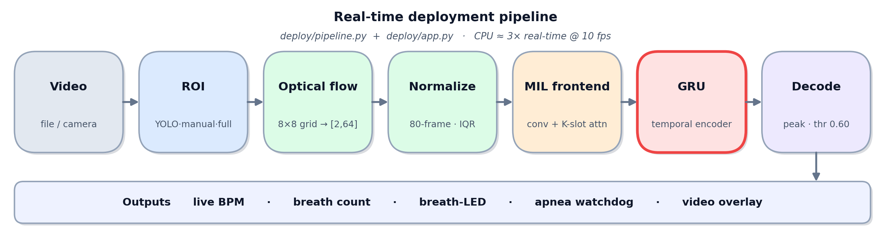
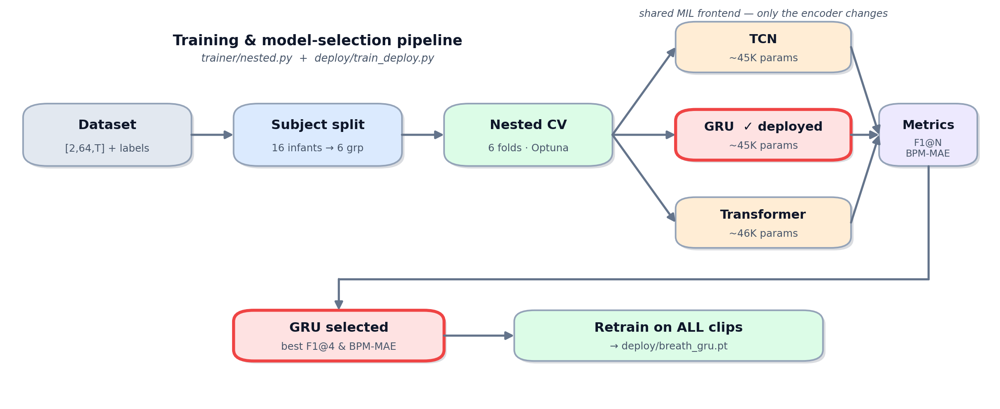

<p align="center">
  
</p>

<h1 align="center">Breathing-Vision</h1>

<p align="center"><strong>Contactless, camera-based infant breath-event detection from ordinary video.</strong></p>

Breathing-Vision extracts sparse optical-flow motion from a sleeping infant's
region of interest and feeds it to a compact temporal neural network that
decides, for each short window, whether a breath occurs at the window centre.
The output is a stream of **breath timings**, a live **respiratory rate (BPM)**,
and a heuristic **apnea alert** — all running in real time on a **CPU**, with no
contact sensors and no dedicated hardware.

Technion, course **046211 – Deep Learning** project.
Authors: **Eliya Reinstein** and **Shira Barmats**.
GitHub repository: <https://github.com/EliyaRein/Breathing-Vision>

---

## 1. Overview

Respiration is a key vital sign for infants, but contact monitors are intrusive
and camera-based estimators in the literature mostly report an *average rate*
over a whole clip. This project targets the harder, deployment-relevant task of
**localising individual breaths near-causally** (as they happen, with a bounded
~1.3 s look-ahead), under a strict real-time information budget.

Pipeline in one line:

> video → ROI → per-cell optical-flow velocities → per-window robust
> normalization → Multiple-Instance-Learning frontend → temporal encoder
> (GRU) → per-window breath probability → peak decoding → BPM / apnea / overlay.

Three param-matched encoders (**TCN, GRU, Transformer**, ~45K params each) were
compared under a **leakage-free, subject-wise nested cross-validation** on 16
infants. The **GRU** was selected for deployment (best F1@4 and BPM-MAE) and
frozen into `deploy/breath_gru.pt`.

> - **F1@N** = breath-timing F1 where a detection counts as correct within ±N frames
> (±0.4 s @10 fps) of the true breath.
> - **BPM-MAE** = mean absolute error of the
> estimated breathing rate. See the project report for the full protocol.

### Application architecture (deployment)



### Training & model-selection pipeline



---

## 2. Repository layout

| Path | Purpose |
|---|---|
| `models.py` | `MILModel`: shared conv stem → **K-slot attention** over 128 axis-level instances → temporal encoder (**TCN / GRU / Transformer**) → readout head. |
| `dataset_builder/` | Build training tensors from AIR-400 `(mp4 + hdf5)` pairs: first-real-frame seek, YOLO ROI, 8×8-grid Shi–Tomasi + Lucas–Kanade optical flow @10 fps, and breath labels. |
| `labels/` | Our **curated breath labels** (final, hand-reviewed) for all 381 clips as a single `breath_labels_10fps.npz` (keyed by clip name), plus the `manual_label_edits.csv` edit log and a manifest. See `labels/README.md`. |
| `trainer/` | Training & evaluation of the single frozen pipeline: `config` (window + normalization), `dataset` (on-the-fly windowing + robust normalization), `harness` (training library: trains one fold; 0.60 decode threshold), `nested` (leakage-free nested CV + per-fold Optuna; only the encoder varies), `metrics` (F1@N, BPM-MAE). |
| `deploy/` | Deployment: `train_deploy.py` (freeze the chosen GRU on all data → `breath_gru.pt`), `pipeline.py` (streaming incremental LK + per-window norm + inference + decode), `app.py` (PyQt5 live app), `assets/` (logo), and the shipped weight **`breath_gru.pt`**. |
| `tools/` | `bench_cpu.py` — measures CPU latency of the core streaming pipeline (optical flow + norm + inference; frames preloaded). |
| `docs/` | Repository schematics + `make_diagrams.py` that regenerates them. |
| `requirements.txt` | Python dependencies. |
| `yolov8m.pt` | YOLOv8 weights for automatic ROI detection (not tracked in git; auto-downloaded by `ultralytics` on first use). |

---

## 3. System requirements

- **OS:** Windows / Linux / macOS (developed and benchmarked on Windows 11).
- **Python:** 3.10+.
- **Hardware:** runs on **CPU** (core streaming pipeline benchmarked at ~3× real-time @10 fps).
  A CUDA GPU is optional and only speeds up training / nested CV.
- **Input:** a video file (e.g. `.mp4`) of a sleeping infant.
- **Disk:** the YOLOv8 weight (~50 MB) is fetched automatically on first ROI detection.

---

## 4. Installation

```bash
git clone https://github.com/EliyaRein/Breathing-Vision.git Breathing-Vision
cd Breathing-Vision

python -m venv .venv
# Windows PowerShell:
.venv\Scripts\Activate.ps1
# Linux / macOS:
# source .venv/bin/activate

pip install -r requirements.txt
```

**Prerequisites** (see `requirements.txt` for the authoritative list):

| Library | Version | Used for |
|---|---|---|
| `torch` | ≥ 2.0 | model, training, inference |
| `numpy` | ≥ 1.24 | array math |
| `scipy` | ≥ 1.10 | peak finding / signal ops |
| `opencv-python` | ≥ 4.8 | video I/O, Lucas–Kanade flow |
| `ultralytics` | ≥ 8.0 | YOLOv8 ROI detection |
| `h5py` | ≥ 3.8 | AIR-400 ground-truth (`.hdf5`) |
| `pandas`, `openpyxl` | ≥ 2.0 / ≥ 3.1 | QC tables / `.xlsx` |
| `scikit-learn` | ≥ 1.3 | `GroupKFold` subject splits |
| `optuna` | ≥ 3.3 | inner hyper-parameter search |
| `PyQt5` | ≥ 5.15 | live desktop app |
| `matplotlib` | ≥ 3.7 | diagram generation |

> `torch` is installed as the default CPU/GPU build for your platform. For a
> specific CUDA build, follow the selector at <https://pytorch.org/get-started/locally/>.

---

## 5. Usage

**Run the live app** (the main deliverable — needs only `deploy/breath_gru.pt`):

```bash
python -m deploy.app
```

Open a video → pick the ROI (auto YOLO / manual drag / whole frame) → watch the
live BPM, breath count, a breath-LED flash on each detection, and (heuristic,
unvalidated) apnea alerts.

**Benchmark CPU latency** of the core streaming pipeline:

```bash
python -m tools.bench_cpu <path-to-video.mp4>
```

**Regenerate the repository schematics:**

```bash
python docs/make_diagrams.py
```

The following commands additionally require the **AIR-400 dataset** (`mp4`/`hdf5`
pairs), which is not redistributed here — download it from the
[AIR-400 Google Drive](https://drive.google.com/drive/folders/1-bYcnAFy15y_sff9-izpPSGS-cinzEut).
`gdown` (in `requirements.txt`) fetches the whole folder automatically:

```bash
gdown --folder https://drive.google.com/drive/folders/1-bYcnAFy15y_sff9-izpPSGS-cinzEut -O AIR_400
```

Our curated breath labels for these clips are already included under `labels/`:

**Build the dataset** (writes per-clip motion tensors + labels under
`dataset_out/dataset_used/`):

```bash
python -m dataset_builder.build_dataset --input AIR_400 --output dataset_out --subjects S01   # smoke-test one subject
python -m dataset_builder.build_dataset --input AIR_400 --output dataset_out                  # full corpus
```

> **Which labels?** By default (`--labels curated`) the builder uses **our
> hand-reviewed labels** from `labels/` — this reproduces the report. Curated
> mode is *strict*: it fails loudly (that clip is marked `FAILED`) if a label
> vector is missing, length-mismatched, or non-binary, so a build is never a
> silent mix of sources. Pass `--labels derive` to instead compute labels
> directly from the raw AIR-400 `hdf5` respiration signals. Switching sources on
> an already-built dataset rebuilds only the clips whose `labels_source`
> differs (recorded in `summary.csv` / `meta.json`). The builder reads `.hdf5`
> either next to the `.mp4` (AIR-125 layout) or under a per-subject `out/` folder
> (AIR-400 layout).

> **Where the trainer looks for data.** `trainer`/`deploy` read the built clips
> from `dataset_out/dataset_used/` relative to the current directory by default.
> If your dataset lives elsewhere, point to it with the `BV_DATASET` environment
> variable (e.g. PowerShell `$env:BV_DATASET="D:\data\dataset_used"`, bash
> `export BV_DATASET=/data/dataset_used`).

**Evaluate under leakage-free nested cross-validation.** 
```bash
python -m trainer.nested --trials 10                 # all three encoders (default)
python -m trainer.nested --model gru --trials 10     # a single encoder
```

**Retrain & freeze the deployment model** on all clips:

```bash
python -m deploy.train_deploy        # writes deploy/breath_gru.pt
```

---

## 6. Method (summary)

- **Input.** Per-cell optical-flow velocities `[2 axes, 64 cells, T]` @10 fps.
- **Normalization.** Robust (IQR) per **80-frame window**, **IQR-only** (no
  centring): the velocity signal is ~zero-mean and its breath extremum sits at a
  zero-crossing, so subtracting the (empirically ~0) median is unnecessary and
  streaming-faithful.
- **MIL.** Each window is a *bag*; the 128 axis-signals are *instances*; a single
  binary label marks a breath at the window centre; a learned **K-slot attention**
  selects and pools the most informative instances.
- **Encoders.** TCN, GRU, Transformer, param-matched (~45K) behind an identical
  MIL frontend; the **GRU** is deployed.
- **Protocol.** Subject-wise **nested CV** (no infant in more than one split),
  inner Optuna for the optimisation hyper-parameters, and a decode
  threshold of 0.60 applied to every fold's validation and test.
  **F1@N** is the primary metric, **BPM-MAE** the secondary.

---

## 7. Headline results

Leakage-free nested CV (6-fold, 16 infants):

| Model | F1@4 | BPM-MAE |
|---|---|---|
| Baseline (windowed, causal) | 0.462 | 5.65 |
| TCN | 0.693 | 5.46 |
| **GRU (deployed)** | **0.705** | **3.99** |
| Transformer | 0.690 | 4.36 |

The deployed GRU's BPM-MAE (**3.99**) falls within the AIR-400 **published
reference range** (3.7–4.0), while additionally localising *individual* breaths
in real time. This is a reference range, not a strict ceiling: AIR-400 report a
different model, protocol, and evaluation setup, so the numbers are indicative
rather than directly comparable.

> The classical **baseline** row (windowed, causal band-pass) was produced by a
> separate research script that is not part of the shipped pipeline; it is
> reported here for context only and is not reproduced by the commands below.

---

## 8. Notes, limitations & ethics

- **Data scale.** 16 infants is small; results demonstrate feasibility and the
  learning methodology rather than a clinically validated product.
- **Apnea alert** is a heuristic time-since-last-breath watchdog; it is **not**
  validated on apnea-labelled data and must not be used for medical decisions.
- **Not a medical device.** Research/educational use only.
- The AIR-400 recordings are the work of Song, Bishnoi et al. (WACV 2026) and are
  used under their terms; **no video is redistributed here** — obtain it from the
  [official AIR-400 repository](https://github.com/michaelwwan/air-400) or the
  [AIR-400 Google Drive](https://drive.google.com/drive/folders/1-bYcnAFy15y_sff9-izpPSGS-cinzEut).
  Only our own derived breath-label annotations (`labels/`) are included.

---

## 9. Credits & citation

- **AIR-400 dataset & respiration baseline** — Song, L.\*, Bishnoi, H.\*, Manne,
  S.K.R., Ostadabbas, S., Taylor, B.J., Wan, M., *"Overcoming Small Data
  Limitations in Video-Based Infant Respiration Estimation"*, **WACV 2026**.
  Official code & data: <https://github.com/michaelwwan/air-400> (MIT License).
  We use their dataset and cite their published respiration-rate results as a
  reference range (different model, protocol, and task, so not a strict ceiling);
  the models, labels, and application here are our own.
- **YOLOv8** ROI detection via [Ultralytics](https://github.com/ultralytics/ultralytics).

```bibtex
@inproceedings{song_bishnoi_overcoming_2026,
  booktitle = {2026 IEEE/CVF Winter Conference on Applications of Computer Vision (WACV)},
  publisher = {IEEE},
  title     = {Overcoming Small Data Limitations in Video-Based Infant Respiration Estimation},
  author    = {Song, Liyang and Bishnoi, Hardik and Manne, Sai Kumar Reddy and
               Ostadabbas, Sarah and Taylor, Brianna J and Wan, Michael},
  year      = {2026},
}
```